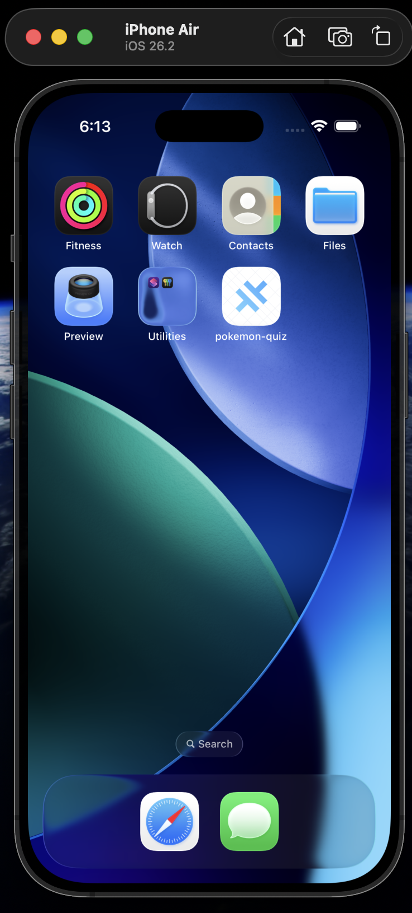
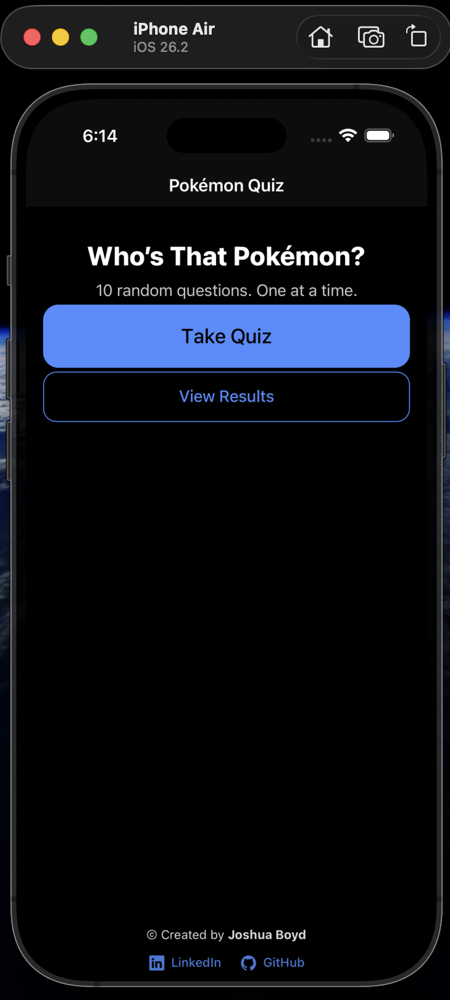
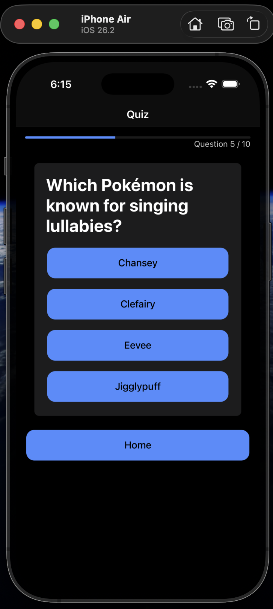
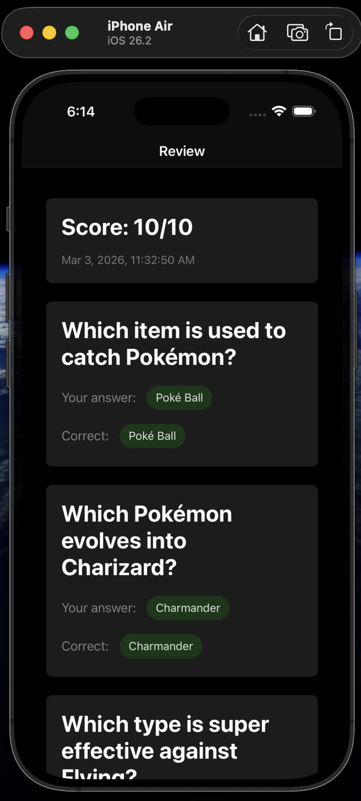

# Pokémon Quiz (Ionic + Angular)

A mobile quiz application built with **Angular**, **Ionic**, and **Capacitor**, demonstrating how a modern Angular application can be packaged and deployed as a native iOS app.

This project showcases a clean Angular architecture adapted for mobile development using Ionic UI components and Capacitor’s native runtime. The application was compiled with **Xcode** and deployed to a physical iPhone during development.

---

## Overview

Pokémon Quiz is a simple mobile quiz app that presents users with **ten randomly selected questions** from a larger question bank. Questions are displayed **one at a time**, and the order of answer choices is shuffled to prevent pattern bias.

Once a quiz is completed, the user can review their results and view a history of previous quiz attempts. All results are stored **locally on the device**, meaning the application does not require any backend services or database.

This project focuses on demonstrating how Angular applications can be structured for mobile environments while maintaining a clean service-based architecture.

---

## Screenshots

<p align="center">
  
  
  
  
</p>

These screenshots illustrate the application running on iOS, including the home screen, quiz interface, results review, and the installed application icon.

---

## Features

- Randomized quiz generation
- Ten-question quiz sessions
- One-question-at-a-time interface
- Shuffled answer choices
- Quiz completion scoring
- Review of previous quiz attempts
- Local storage persistence
- Native mobile UI using Ionic components
- Deployment to iOS using Capacitor and Xcode

---

## Technology Stack

**Framework**

- Angular (Standalone Components)

**Mobile UI**

- Ionic Framework

**Native Bridge**

- Capacitor

**Native Build Environment**

- Xcode (iOS)

**Language**

- TypeScript

---

## Application Architecture

The project follows a simple Angular architecture that separates data, logic, and presentation.

### Services

Two Angular services power the application.

#### `QuestionsService`

Provides a collection of quiz questions used by the application.  
Each question contains:

- question text
- multiple answer options
- the correct answer index

#### `QuizService`

Handles quiz generation and result storage.

Responsibilities include:

- randomly selecting questions
- shuffling answer choices
- calculating quiz scores
- storing completed quiz sessions
- persisting results in `localStorage`

---

### Pages

The application consists of four main pages.

#### Home Page

The entry point of the application.  
Users can start a new quiz or view their quiz history.

#### Quiz Page

Displays quiz questions one at a time with multiple-choice answer buttons.

#### Quiz Completion Page

Appears when a quiz session finishes and allows the user to review their results.

#### Quiz Review Page

Displays all questions from a completed quiz along with:

- the user’s selected answer
- the correct answer
- the final score

<hr/>

## Project Setup

### Prerequisites

- Node.js
- Angular CLI
- Ionic CLI
- Xcode (for iOS builds)

Install the Ionic CLI if it is not already installed:

```bash
npm install -g @ionic/cli
```
<hr/>

### Installation

Clone the repository:
```bash
git clone https://github.com/creativeisaiah/pokemon-quiz.git
cd pokemon-quiz
```

Install dependencies:
```bash
npm install
```
<hr/>

### Running the Application (Web)

Start the development server:
```bash
ionic serve
```

The application will be available in the browser at:
```bash
http://localhost:8100
```
<hr/>

## Running the Application on iOS

Build the Angular application:
```bash
ionic build
```

Sync the project with Capacitor:
```bash
ionic cap sync ios
```

Open the iOS project in Xcode:
```bash
ionic cap open ios
```
From Xcode:

  1) Connect an iPhone or select a simulator

  2) Configure signing under Signing & Capabilities

  3) Press Run to install the application

<hr/>

### Purpose of the Project

This project was created to demonstrate:

- how Angular applications can be adapted for mobile environments

- how Ionic components provide native-style mobile UI

- how Capacitor bridges web applications to native platforms

- how a full mobile development pipeline can be implemented using web technologies

<hr/>


### &copy; 2026 | Joshua Boyd


### <a href="https://www.linkedin.com/in/joshua-boyd-969781140/">LinkedIn<a/> | <a href="https://github.com/creativeisaiah">GitHub<a/> 

